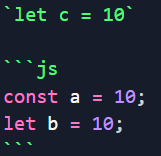

# Tutoriál na MarkDown

Výtejte na tutoriálu na MarkDown! V tomto tutoriálu se zaměříme na markdown a naučíme se ho pomocí markdownu

## Jak markdown psát

Nejdříve ze všeho je nutné si založit soubor .md doporučuji vscode jelikož tam když použijete klávesovou zkratku `ctrl + shift + p` a dáte příkaz `Markdown: open preview to the side` uvidíte live Váš zformátovaný soubor

## Nadpisy

Velice důležitým prvkem každého textu jsou jeho nadpisy a v markdown je to vyřešeno velice elgantně před každý nadpis dáte `#` čím více `#` dáte tím bude nadpis menší například `# Hlavní nadpis` a poté `## Podnadpis`

## Úprava textu

Dalším velice důležitým tématem je zvíraznění textu to se dělá pomocí `*` když chci například ztučnit **slovo** musím to napsat takto `**slovo**`. Pokud chci na _slovo_ použít kurzívu udělám to takto `*slovo*`. Pokud ovšem toto chceme **_zkombinovat_** stačí pouze `***zkombinovat***`.

Pokud chceme text <mark>zvýraznit</mark> tak stačí ho napsat do tagů `<mark>zvýraznit</mark>`

Přeškrtnutí ~~textu~~ pomocí `~~textu~~`

A pokud si rádi hrajeme s mocninamy X<sup>2</sup> stačí `X<sup>2</sup>`

Ovšem i chemické prvky jdou napsat bez problémů H<sub>2</sub>0 pomocí `H<sub>2</sub>0`

## Kód v textu

Napsání kódu v textu je velice jednoduché a praktické stačí veškerý požadovaný text napsat  


můžeme zde psát do jednoduchých pouze řádkový kód a nebo pomocí tří a specifikovýní jazyka jsme schopni psát celkový kód

## Obrázky

Pokud chceme přidat obrázek do našeho .md souboru tak stačí poze ``

## Odkazy

Pokud chceme přidat odkaz `[Toto je odkaz](https://github.com/)`

## Pokročilá úprava textu

Když potřebujeme odsadit text stačí dat počet `>` požadovanému odsazení textu

Rovná čárase dělá velice jednoduše pomocí `---`

Číselný seznam uděláme takto

```
1. Item 1
2. Item 2
3. Item 3

+ Item 1
+ Item 2
+ Item 3
  - item 3.1
```

tabulka
| col1 | col2 |
| :---: | ---: |
| toto | je |
| krásná | tabulka |

Zde si může všimnout že máme tabulku seřazenou buď do středu nebo k pravému okraji toho se jednoduše docílí pomocí : na požadovaném místě

```
| col1   |  col2   |
| :---:  | ---:    |
| toto   |    je   |
| krásná | tabulka |
```

A jako poslední se podíváme na zašktávací boxy

```
- [ ] Nezaškrtnuto
- [x] Zaškrtnuto
```
